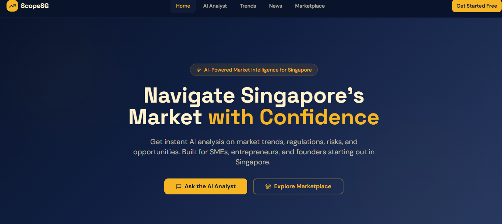

# ScopeSG

AI-powered market intelligence for Singapore's SMEs and entrepreneurs.

Live demo: [[scopesg2.vercel.app](http://scopesg2.vercel.app)]([https://scopesg2.vercel.app](https://scopesg2.vercel.app))

## Why I built this

Singapore has a lot of support for SMEs — grants, schemes, regulatory guidance — but it's scattered across dozens of government sites and PDFs. If you're a founder trying to figure out what grants you qualify for, what licenses you need, or what hiring will actually cost after CPF, there's no easy starting point.

ScopeSG is an AI analyst that understands Singapore's specific business landscape and gives founders a fast, grounded read on their idea — grants, compliance, costs, competitors — before they commit real time or money.

Starting a business/startup can be daunting. Many costs add up, with uncertainty. Why not leverage on ScopeSG to garner more detailed, planned information at a small cost of $20, compared to struggling over regulatory concerns and other matters?

I built this to combine my interest in Singapore's SME and policy space (I study Public Policy & Global Affairs at NTU) with hands-on product work — the AI integration, the database and security decisions, the pricing model, all of it.

## What it does

- AI chat consultant that asks about your business idea and gives Singapore-specific guidance, not generic startup advice

- One-click tools: grant matching, compliance checklists, location comparisons, CPF/hiring cost calculators

- Paid market intelligence reports (S$20) with live web search for current data

- A marketplace where founders can post funding requests, partnerships, or hiring needs

- Market trends and news pages

## Stack

React, TypeScript, Vite, Tailwind, Supabase (Postgres, Auth, RLS, Edge Functions), Claude (Anthropic API), Stripe, deployed on Vercel.

Built using Bolt and Cursor for development, with Claude also assisting on architecture, debugging, and security review throughout.

Cadmus Chau — NTU, Public Policy & Global Affairs

